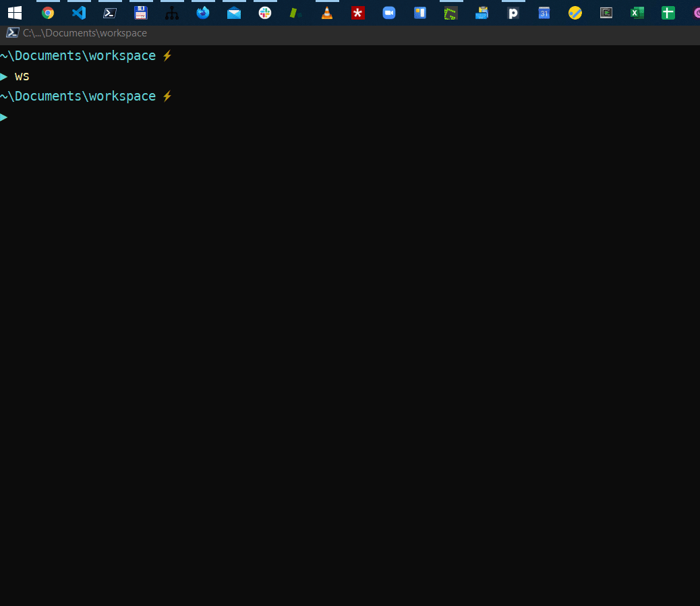
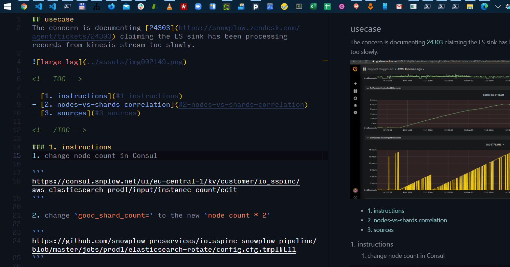

## Support Docs of Snowplow Analytics

This repository consists of 
    * knowledge base  created and utilized by support engineers of Snowplow Analytics 
    * scripts that handle pushing these into a particular [Zendesk Help Center](https://support.snowplowanalytics.com/hc/en-us).

Both current trends (mozzila, gitlab) and old practices (first wiki ever) imply that any useful documentation needs to be created with 
    * ease — works out of the box, as few steps as possible, no extra learning needed
    * speed — proximity to CLI & code editor, both intimatelly known for operational purposes

Visualized, the process of creating and publishing a document looks roughly like this

### 1. pre-prod
* Use Start Menu (Win) or Spotlight (Mac) to call `opsdocs` script which 
    * Creates a new document in right folder
    * The new document is populated with a template — we are using single-template documentation
    * Updates the index in `config.yaml`, which is used later to maintain the state (diff between what's in ZD and REPO)
    * All of this should take ~5 seconds of the writer's time, without mouse

### 2. prod
* This is where the KB is created 
* Style-Guide && KB-Structure need to be paid proper attention, but are not a concern at this point

### 3. post-prod
2. After work on documents is done, it gets to be pushed to zendesk — currently by running the `publish.js` **locally**. 
    * Later it should be ran automatically upon **git push**ing the new content to github via github action
    * This converts the markdown into html
    * Updates the state in `config.yaml`
    * Creates proper links to static assets hosted on github (they are not pushed to zendesk)
    * For a writer, this should take also ~5 seconds

