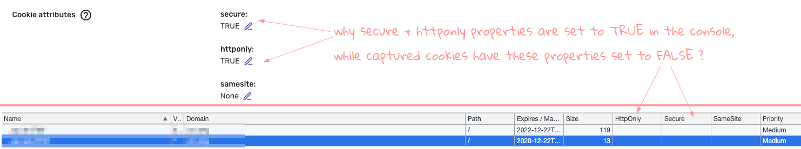
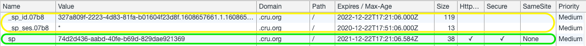

## Overview
The aim of this document is explaining the properties of cookies set by the Snowplow Collector - as opposed to cookies set by the client-side trackers (e.g. Javascript)

### Use cases

* [25064](https://snowplow.zendesk.com/agent/tickets/25064) 
* client sharing this screenshot

## Explanation

* The shared screenshot of cookies is not relevant to the cookie set by the collector. 
* In general, there are 2 types of cookies set in the browser:

CLIENT-SIDE               | SERVER-SIDE
--------------------------|-----------------
set by Javascript tracker | set by collector
`domain_userid`           | `network_userid`
`domain_sessionidx`       |
`domain_sessionid`        |

* The settings in Insights Console controls only **cookies set by the collector**  
* This is the cookie that really needs to be controlled in that way as they set by the collector (remote server). If you want to set those properties to the cookie set by the tracker you need to configure the tracker itself as per this doc. However, this is the 1st party cookie set client-side; it is always set on the same domain as your web application and should not cause any issue.

## Can a Client-Side Cookie be httpOnly ? 
* It's irrelevant to client-side set cookies (in Snowplow pipeline context) 
* Why ? The tracker should be able to access that cookie — if it is to be set to `HttpOnly` it would become programmatically inaccessible by your tracker and only sent via HTTP protocol to the server

> A cookie with the HttpOnly attribute is inaccessible to the JavaScript Document.cookie API; it is sent only to the server.
> For example, cookies that persist server-side sessions don't need to be available to JavaScript, and should have the HttpOnly attribute. This precaution helps mitigate cross-site scripting (XSS) attacks.

— from <https://developer.mozilla.org/en-US/docs/Web/HTTP/Cookies#restrict_access_to_cookies>

* It is different from the server-side set cookie which would be read by the remote server 
* Setting it to `HttpOnly` prevents it to be read by scripts — but still make it available to the collector.

## Sources
* [Using HTTP cookies - MDN](https://developer.mozilla.org/en-US/docs/Web/HTTP/Cookies#restrict_access_to_cookies)