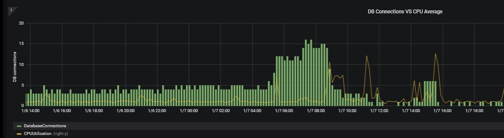
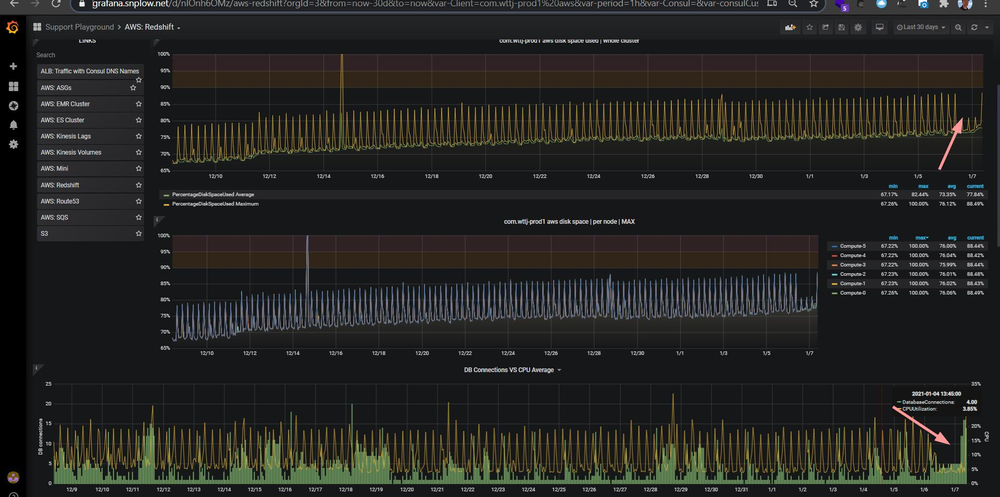

## usecase

The doc's aim is comments to [25141](https://snowplow.zendesk.com/agent/tickets/25141) with:
*  DM job failing after 8 hours at a particular task with

```
i/o timeout
```

* The same happened for the `VACUUM` job that ran at night
* Next day, the DM job succeeded, but the same task run also took much longer



* Looking from a 7-day perspective there are irregularities in most of the metrics



### 1. explanation
* Stats on the cluster look generally fine
    1. no excessive queries
    2. no excessive connections
    3. no excessive CPU use
* 10 extra database connections are not really that irregular or out of the ordinary
* If the cluster is not performing as expected Snowplow's only recourse is to reboot it and see if it functions as expected after
* If it continues to misbehave it is better to get the client involved to see what they are doing 
* ultimately we do not control what they do so — **performance issues are almost always caused by the client doing something**
    * Either too many concurrent queries, expensive data models, locking tables up, etc
* The next escalation point is reaching out to Amazon support — this is often more effective than asking us why the client's Redshift cluster is not working as expected 
* In conclusion, we load data in, but we cannot debug client's queries that are not running how they want them to

### 2. sources
* [25141](https://snowplow.zendesk.com/agent/tickets/25141)