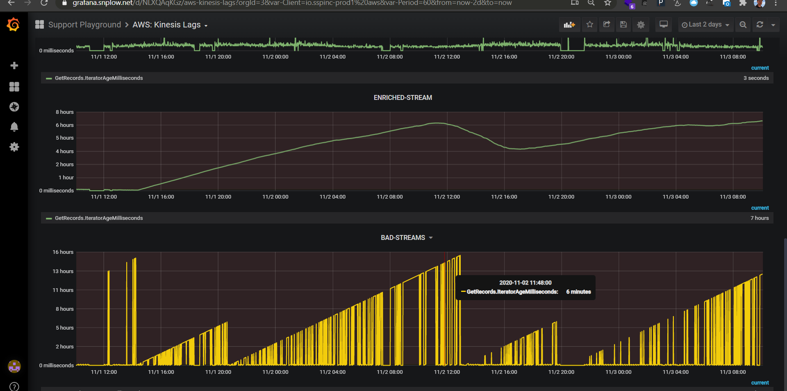
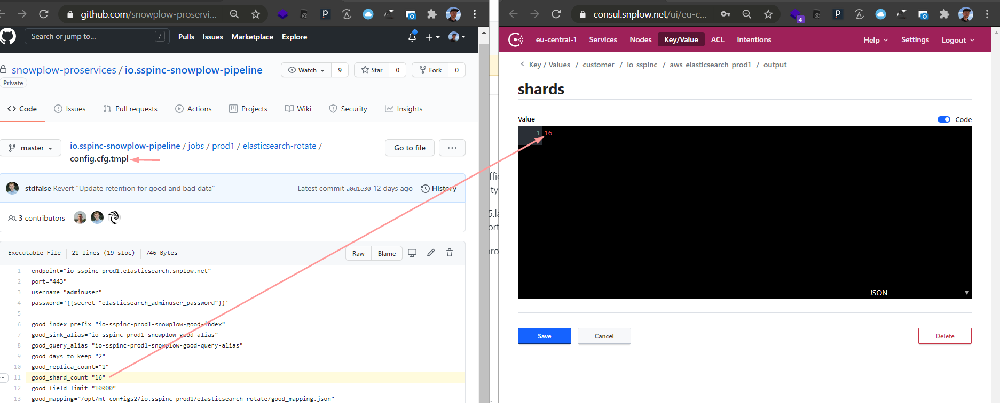

## usecase
The concern is documenting [24303](https://snowplow.zendesk.com/agent/tickets/24303) claiming the ES sink has been processing records from kinesis stream too slowly. 



<!-- TOC -->

- [1. instructions](#1-instructions)
- [2. nodes-vs-shards correlation](#2-nodes-vs-shards-correlation)
- [3. sources](#3-sources)

<!-- /TOC -->

### 1. instructions
1. change node count in Consul

```
https://consul.snplow.net/ui/eu-central-1/kv/customer/io_sspinc/aws_elasticsearch_prod1/input/instance_count/edit 
```

2. change `good_shard_count=` to the new `node count * 2`

```
https://github.com/snowplow-proservices/io.sspinc-snowplow-pipeline/blob/master/jobs/prod1/elasticsearch-rotate/config.cfg.tmpl#L11
```

3. merge changes and wait for sync — note that even after deployment, the re-sharding happens only during the ES-rotate job

```
https://github.com/snowplow-proservices/io.sspinc-snowplow-pipeline/pull/64
```

4. deploy changes

```
@Snowdroid deploy stacks/apply_last 0.1.0 false for io_sspinc_prod1 aws_elasticsearch
```

5. check the output key if that has propagated properly



6. check if the rotate job has run succesfully

### 2. nodes-vs-shards correlation
* when updating the number of ES-nodes, the number of ES-shards you should configure indexes with **changes as well**
* We calculate this automatically and output it to Consul here

```
https://consul.snplow.net/ui/eu-central-1/kv/customer/io_sspinc/aws_elasticsearch_prod1/output/shards/edit
```

* This works out essentially to be `nodes * 2 == shard` count 
    * 1 node is handling 2 shards
* You then need to just update the rotation schedule to use this counter:

```
https://github.com/snowplow-proservices/io.sspinc-snowplow-pipeline/blob/master/jobs/prod1/elasticsearch-rotate/config.cfg.tmpl#L11
```

* What this does is
    * spread the index evenly across all nodes 
    * greatly reduces the chance of a single node failure causing a data failure


### 3. sources
* [21624](https://snowplow.zendesk.com/agent/tickets/21624)

