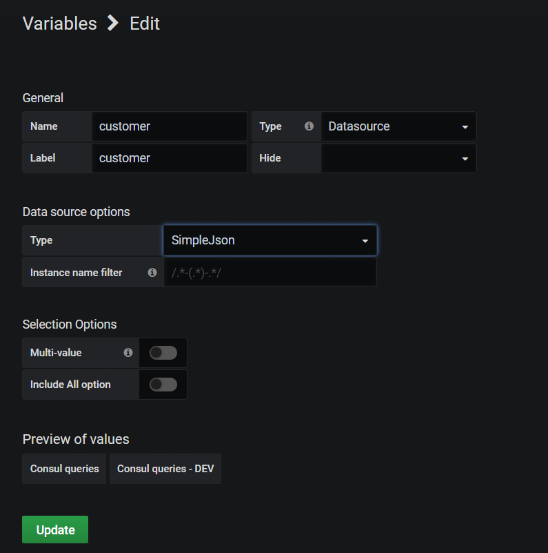
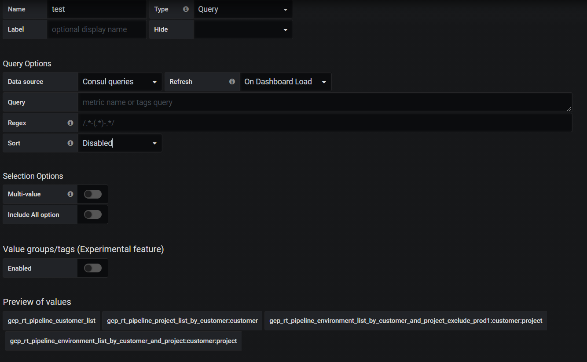
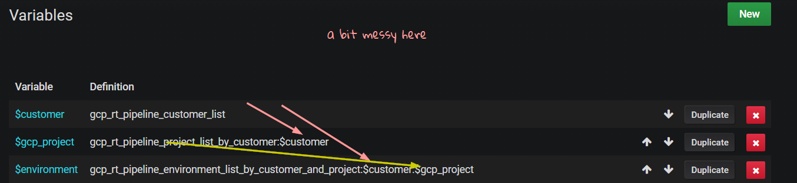
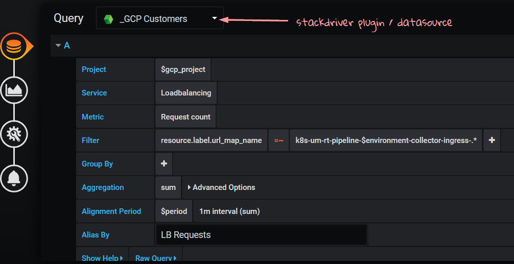

# TEST TEST
## usecase
The concern is documenting creating/understanding first dashboards in Grafana for GCP

<!-- TOC -->

- [1. variables](#1-variables)
    - [1.1. customers are from consul](#11-customers-are-from-consul)
    - [1.2. period](#12-period)
- [2. stackdriver as datasource](#2-stackdriver-as-datasource)
- [3. how to navigate this source](#3-how-to-navigate-this-source)
- [4. build a new one](#4-build-a-new-one)
- [5. filter](#5-filter)
- [6. UIUX](#6-uiux)
- [7. sources](#7-sources)

<!-- /TOC -->

### 1. variables
#### 1.1. customers are from consul
* change! change! change!



* there are consul queries you can check
* you can see queries as well




* you need 3 vars to query properly
    * customer > project > environment

#### 1.2. period
* period must end with `s`
* this is my list

```
60s, 300s, 900s, 3600s, 20400s, 43200s, 86400s
```

### 2. stackdriver as datasource



### 3. how to navigate this source
* [Cloud Monitoring - Grafana Labs](https://grafana.com/docs/grafana/latest/datasources/cloudmonitoring/)
* this is their own thing, their own world
* metrics explanation is simpler than Cloudwatch's the portal

> https://cloud.google.com/monitoring/api/metrics_gcp

### 4. build a new one
* 4 variables as explained above
* new query
* in Project, enter `$gcp_project`
* before, you select customer, that field is looked-up from consul-query json and that populates the Stackdriver field
* put template variable `$period` into Alignment Perios 

### 5. filter
* in filter use `=~` operator which activates the use of regex
* for regex use the following syntax

```
\.*mini\.* -> escape regex literals with `\`
```

### 6. UIUX
* it should be clear & bold

### 7. sources
* [Cloud Monitoring - Grafana Labs](https://grafana.com/docs/grafana/latest/datasources/cloudmonitoring/)